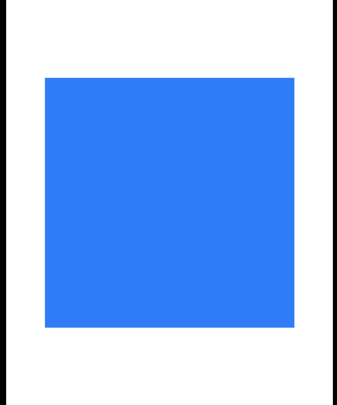
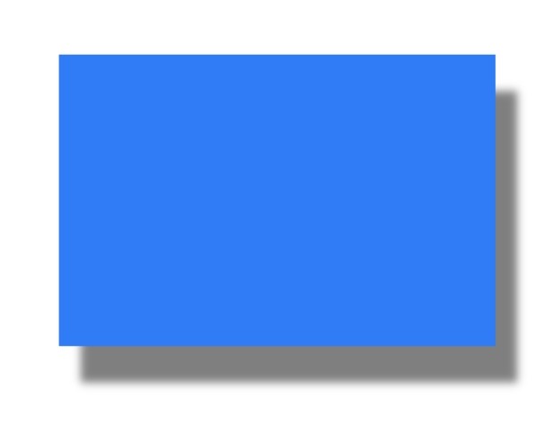
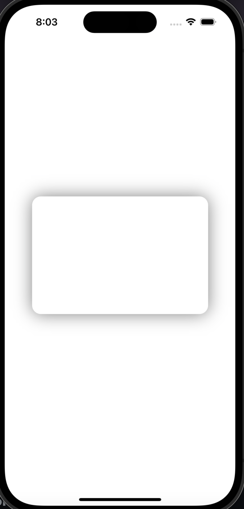
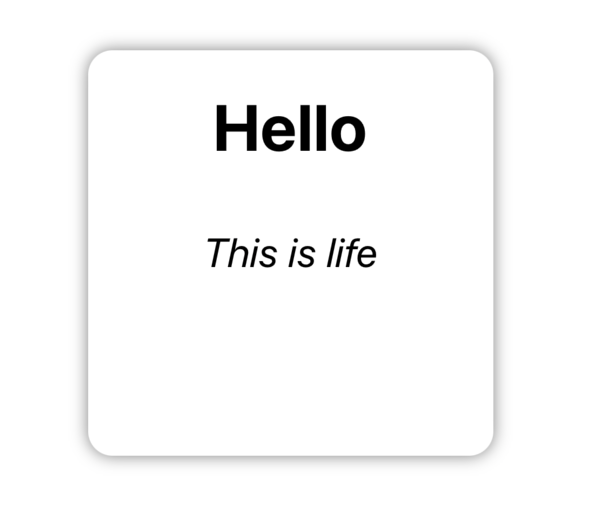

# Shadows
## A Simple drop shadow
Let start by adding a simple view with background color blue to the Viewcontroller

```swift
import UIKit

class ViewController: UIViewController {

    let shadowView = UIView()
    
    override func viewDidLoad() {
        super.viewDidLoad()
        
        setup()
    }
    
    func setup()  {
        view.addSubview(shadowView)
        
        shadowView.backgroundColor = .systemBlue
        shadowView.translatesAutoresizingMaskIntoConstraints = false
        
        NSLayoutConstraint.activate([
            shadowView.centerXAnchor.constraint(equalTo: view.centerXAnchor),
            shadowView.centerYAnchor.constraint(equalTo: view.centerYAnchor),
            
            // setting the size, if we dont do this, it will use the intrinsic size which will be 0
            shadowView.widthAnchor.constraint(equalToConstant: 300),
            shadowView.heightAnchor.constraint(equalToConstant: 200)
        ])
    }
}
```



In order to add shadow effect to the view, we need to access the views CALayer and use it shadow properties as shown below

```swift
func setup() {

        NSLayoutConstraint.activate([ ...])
        
        // SOME SHADOW PROPERTIES
        // how dark or light the shadow is. The range is between 0 and 1
        shadowView.layer.shadowOpacity = 0.5
        // how to extend the shadow beyound the view. The default is width: 0, height: -3
        // chage the width and height to see how the shadow extends
        shadowView.layer.shadowOffset = CGSize(width: 15, height: 20)
}
```



## Custom UIView with Shadows
### Here is a custom view that has a white background and some shadowing

```swift
class CustomRectangleView : UIView {
    
    override init(frame: CGRect) {
        super.init(frame: frame)
        
        setupView()
      }
    
    required init?(coder: NSCoder) {
        fatalError("init(coder:) has not been implemented")
    }
    
    func setupView() {
        self.backgroundColor = .white
        self.layer.cornerRadius = 15
        self.layer.shadowColor = UIColor.black.cgColor
        self.layer.shadowOpacity = 0.5
        self.layer.shadowOffset = .zero
        self.layer.shadowRadius = 5
      }
}
```
And the Viewcontroller

```swift 
class ViewController: UIViewController {
    
    let shadowView = CustomRectangleView()
    
    override func viewDidLoad() {
        super.viewDidLoad()
        
        setup()
    }
    
    func setup()  {
        view.addSubview(shadowView)
        shadowView.translatesAutoresizingMaskIntoConstraints = false
        
        NSLayoutConstraint.activate([
            shadowView.centerXAnchor.constraint(equalTo: view.centerXAnchor),
            shadowView.centerYAnchor.constraint(equalTo: view.centerYAnchor),
            shadowView.widthAnchor.constraint(equalToConstant: 300),
            shadowView.heightAnchor.constraint(equalToConstant:200)
        ])
    }
}
```

This will create a custom view that has a white background color and a shadow with specific properties. When creating an instance of the CustomRectangleView, we can specify its frame/layout and add it to the view hierarchy (I did it with constraints)



## Example Using CustomRectangleView
``` swift
class CustomTextView : UIView {
    
    let backgroundView = CustomRectangleView()
    let userTextLabel = UILabel()
    let viewTextLabel = UILabel()
    
    init(text: String){
        super.init(frame: .zero)
        
        userTextLabel.text = text
        
        setup()
    
    }
    
    required init?(coder: NSCoder) {
        fatalError("init(coder:) has not been implemented")
    }
    
    func setup()  {
        addSubview(backgroundView)
        addSubview(userTextLabel)
        addSubview(viewTextLabel)
    
        backgroundView.translatesAutoresizingMaskIntoConstraints = false
        
        userTextLabel.translatesAutoresizingMaskIntoConstraints = false
        userTextLabel.font = .systemFont(ofSize: 40, weight: .bold)
        
        viewTextLabel.translatesAutoresizingMaskIntoConstraints = false
        viewTextLabel.text = "This is life"
        viewTextLabel.font = .italicSystemFont(ofSize: 25)
        
        NSLayoutConstraint.activate([
            backgroundView.topAnchor.constraint(equalTo: topAnchor),
            backgroundView.bottomAnchor.constraint(equalTo: bottomAnchor),
            backgroundView.leadingAnchor.constraint(equalTo: leadingAnchor),
            backgroundView.trailingAnchor.constraint(equalTo: trailingAnchor),
            
            userTextLabel.topAnchor.constraint(equalToSystemSpacingBelow: backgroundView.topAnchor, multiplier: 3),
            userTextLabel.centerXAnchor.constraint(equalTo: centerXAnchor),
            
            viewTextLabel.centerXAnchor.constraint(equalTo: centerXAnchor),
            viewTextLabel.centerYAnchor.constraint(equalTo: centerYAnchor)
        ])
    }
}

```
And the ViewController
```swift
class ViewController: UIViewController {
    
    let shadowView = CustomTextView(text: "Hello")
    
    override func viewDidLoad() {
        super.viewDidLoad()
        
        setup()
    }
    
    func setup()  {
        view.addSubview(shadowView)
        
        shadowView.translatesAutoresizingMaskIntoConstraints = false
        
        NSLayoutConstraint.activate([
            shadowView.centerXAnchor.constraint(equalTo: view.centerXAnchor),
            shadowView.centerYAnchor.constraint(equalTo: view.centerYAnchor),
            shadowView.widthAnchor.constraint(equalToConstant: 250),
            shadowView.heightAnchor.constraint(equalToConstant:250)
        ])
    }
}


```



## Links
- https://medium.com/swlh/how-to-create-advanced-shadows-in-swift-ios-swift-guide-9d2844b653f8
