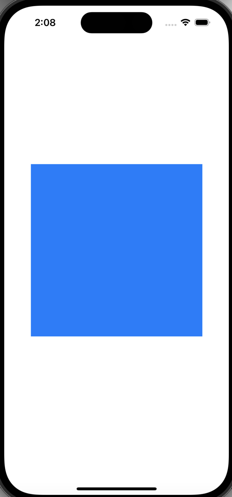

# Shadows
## A Simple drop shadow
Let start by adding a simple view to the Viewcontroller

```swift
import UIKit

class ViewController: UIViewController {

    let shadowView = UIView()
    
    override func viewDidLoad() {
        super.viewDidLoad()
        
        setup()
    }
    
    func setup()  {
        view.addSubview(shadowView)
        
        shadowView.backgroundColor = .systemBlue
        shadowView.translatesAutoresizingMaskIntoConstraints = false
        
        NSLayoutConstraint.activate([
            shadowView.centerXAnchor.constraint(equalTo: view.centerXAnchor),
            shadowView.centerYAnchor.constraint(equalTo: view.centerYAnchor),
            
            // setting the size, if we dont do this, it will use the intrinsic size which will be 0
            shadowView.widthAnchor.constraint(equalToConstant: 300),
            shadowView.heightAnchor.constraint(equalToConstant: 200)
        ])
    }
}
```


